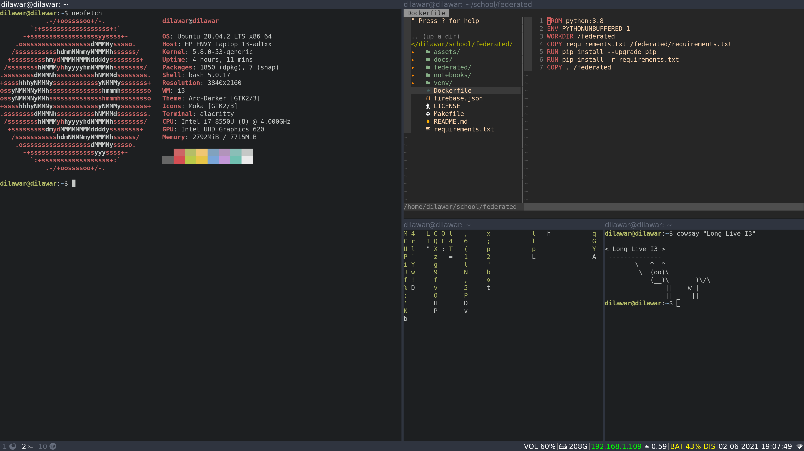
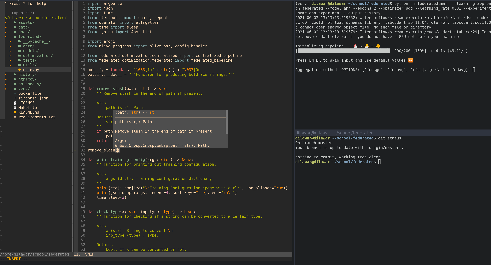

# dotfiles

Some dotfiles for configuring _i3_ and _neovim_ :computer:

## i3

## neovim

## Contribution

If you notice any weaknesses with my simple setup, or if you have any thoughts, please let me know by making an Issue :slightly_smiling_face:
